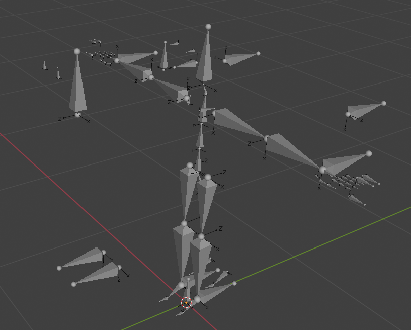

# Redot Humanoid Skeleton
A skeletal rig compliant to Redot's SkeletalHumanoidProfile specification. Makes animation retargeting easier for your games. Also includes basic IK chain commonly used for character animation in games.

## Clean:
1. Bone rolls are uniform, favoring their z-axes for facing their rotational directions.
2. Bones for arms, legs, fingers, toes, etc. have their tails and heads well aligned when needed. You just need to resize some bones to match the joints of your mesh and align the spine bones with the character's torso proportions.
3. A clean .blend file; no actions, materials, textures, etc. to sift through muddying up the file, making it easy to export to Redot.

## IK chains included:
IK chains included for head, eyes, jaw, arms, fingers (thumbs and trigger fingers separately), legs, feet, and toes.